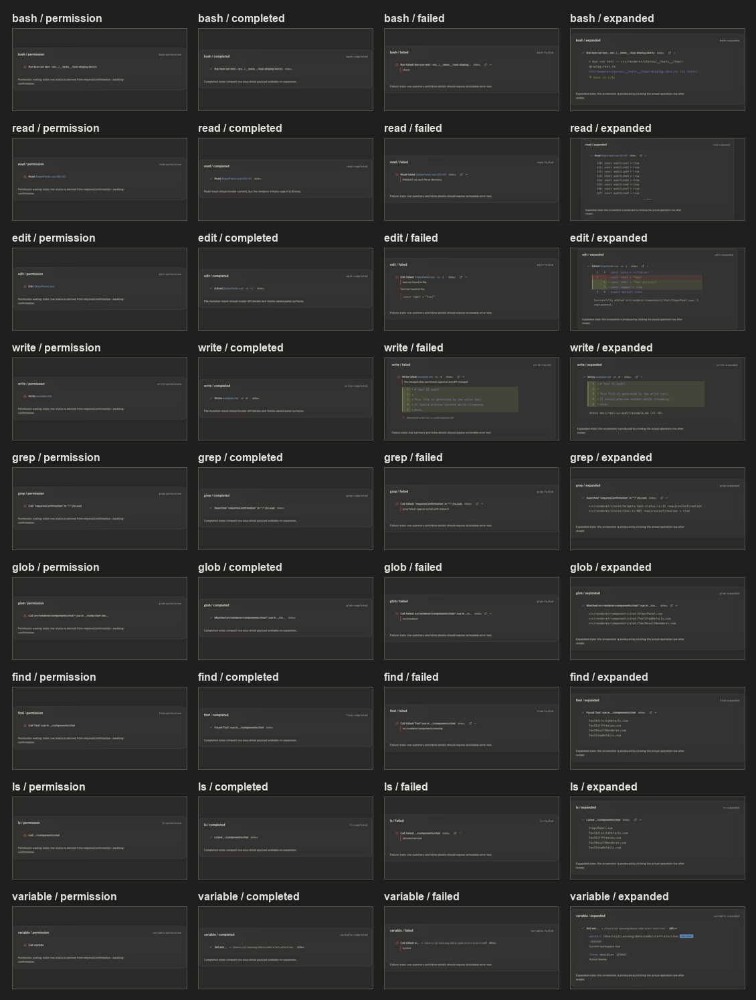
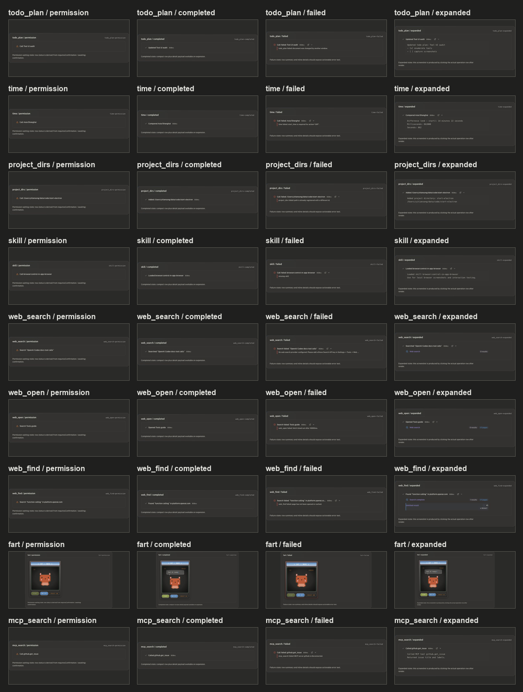
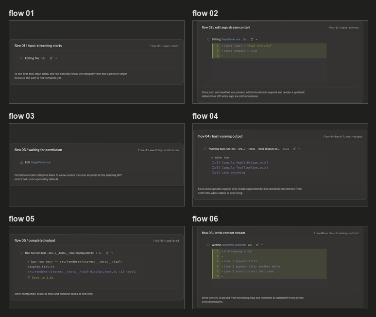
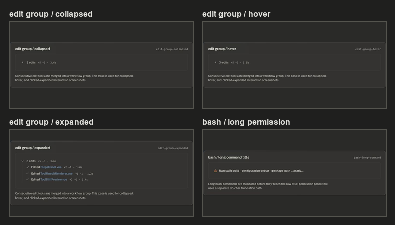

# Tool UI Screenshot Index

本索引覆盖当前审计生成的所有工具截图。测试方式是用固定 fixture 挂载真实 `StepsPanel.vue` / `ToolStepDetails.vue` / `ToolResultRenderer.vue` 组件，构造 permission、completed、failed、expanded 等状态；截图输出位于 `docs/tool-ui-audit/screenshots/`。

## Contact Sheets

## Tool Matrix

| Tool | Waiting permission | Completed | Failed | Expanded |
|---|---|---|---|---|
| `bash` | [screenshot](screenshots/bash__permission.png): warning icon + `Run` + truncated command preview; no stdout/stderr content. | [screenshot](screenshots/bash__completed.png): one-line summary only; no result until expand. | [screenshot](screenshots/bash__failed.png): failed row + short error summary. | [screenshot](screenshots/bash__expanded.png): renders command/result/done lines inside bash renderer. |
| `read` | [screenshot](screenshots/read__permission.png): warning icon + file/line preview; no file content. | [screenshot](screenshots/read__completed.png): title only; content is hidden. | [screenshot](screenshots/read__failed.png): failed row + error summary. | [screenshot](screenshots/read__expanded.png): content appears, but initially capped to 8 lines with `more`. |
| `edit` | [screenshot](screenshots/edit__permission.png): waiting row with file name; diff is available in data but not opened by default. | [screenshot](screenshots/edit__completed.png): only file name, stats, duration. | [screenshot](screenshots/edit__failed.png): default-expanded error-specific UI shows missing old text. | [screenshot](screenshots/edit__expanded.png): diff panel plus success text. |
| `write` | [screenshot](screenshots/write__permission.png): waiting row with target file; pending diff is not opened by default. | [screenshot](screenshots/write__completed.png): title + stats only. | [screenshot](screenshots/write__failed.png): default-expanded diff + attempted write note. | [screenshot](screenshots/write__expanded.png): diff-style content panel plus write result. |
| `grep` | [screenshot](screenshots/grep__permission.png): query preview in title. | [screenshot](screenshots/grep__completed.png): title only. | [screenshot](screenshots/grep__failed.png): short error summary. | [screenshot](screenshots/grep__expanded.png): text result lines in generic pre panel. |
| `glob` | [screenshot](screenshots/glob__permission.png): pattern preview can be long and ellipsized. | [screenshot](screenshots/glob__completed.png): title only. | [screenshot](screenshots/glob__failed.png): short error summary. | [screenshot](screenshots/glob__expanded.png): matched paths shown only after expand. |
| `find` | [screenshot](screenshots/find__permission.png): pattern/path preview. | [screenshot](screenshots/find__completed.png): title only. | [screenshot](screenshots/find__failed.png): short error summary. | [screenshot](screenshots/find__expanded.png): result file list in generic text panel. |
| `ls` | [screenshot](screenshots/ls__permission.png): directory preview. | [screenshot](screenshots/ls__completed.png): title only. | [screenshot](screenshots/ls__failed.png): permission/path error summary. | [screenshot](screenshots/ls__expanded.png): directory entries in generic text panel. |
| `variable` | [screenshot](screenshots/variable__permission.png): action + target. | [screenshot](screenshots/variable__completed.png): title only. | [screenshot](screenshots/variable__failed.png): short error summary. | [screenshot](screenshots/variable__expanded.png): structured variable rows with tag badges. |
| `todo_plan` | [screenshot](screenshots/todo_plan__permission.png): action target. | [screenshot](screenshots/todo_plan__completed.png): title only. | [screenshot](screenshots/todo_plan__failed.png): short conflict summary. | [screenshot](screenshots/todo_plan__expanded.png): plain text result; no task-specific renderer here. |
| `time` | [screenshot](screenshots/time__permission.png): action/timezone target. | [screenshot](screenshots/time__completed.png): title only. | [screenshot](screenshots/time__failed.png): validation error summary. | [screenshot](screenshots/time__expanded.png): plain text time calculation. |
| `project_dirs` | [screenshot](screenshots/project_dirs__permission.png): action target. | [screenshot](screenshots/project_dirs__completed.png): title only. | [screenshot](screenshots/project_dirs__failed.png): duplicate/path error summary. | [screenshot](screenshots/project_dirs__expanded.png): plain text result. |
| `skill` | [screenshot](screenshots/skill__permission.png): skill action/name. | [screenshot](screenshots/skill__completed.png): title only. | [screenshot](screenshots/skill__failed.png): missing skill summary. | [screenshot](screenshots/skill__expanded.png): plain text skill result. |
| `web_search` | [screenshot](screenshots/web_search__permission.png): query preview. | [screenshot](screenshots/web_search__completed.png): title only. | [screenshot](screenshots/web_search__failed.png): configuration error summary. | [screenshot](screenshots/web_search__expanded.png): web-search renderer cards/results. |
| `web_open` | [screenshot](screenshots/web_open__permission.png): page title/host target. | [screenshot](screenshots/web_open__completed.png): title only. | [screenshot](screenshots/web_open__failed.png): timeout summary. | [screenshot](screenshots/web_open__expanded.png): web page result renderer. |
| `web_find` | [screenshot](screenshots/web_find__permission.png): pattern + host target. | [screenshot](screenshots/web_find__completed.png): title only. | [screenshot](screenshots/web_find__failed.png): cache/page error summary. | [screenshot](screenshots/web_find__expanded.png): web-find structured result. |
| `fart` | [screenshot](screenshots/fart__permission.png): renders arcade cabinet; no standard warning/permission row. | [screenshot](screenshots/fart__completed.png): same custom surface, status through HUD only. | [screenshot](screenshots/fart__failed.png): HUD error path, still outside shared timeline UI. | [screenshot](screenshots/fart__expanded.png): no meaningful expanded state; custom renderer ignores row affordances. |
| `mcp_search` | [screenshot](screenshots/mcp_search__permission.png): generic MCP call target. | [screenshot](screenshots/mcp_search__completed.png): title only. | [screenshot](screenshots/mcp_search__failed.png): disconnected server summary. | [screenshot](screenshots/mcp_search__expanded.png): generic text result. |

## Flow Sequence

| Phase | Screenshot | Observation |
|---|---|---|
| 01 input start | [screenshot](screenshots/flow-01.png) | At first tool-input delta, path/content are incomplete; row shows generic `Editing file`, spinner, duration. |
| 02 edit args streaming | [screenshot](screenshots/flow-02.png) | Once path and `newText` exist, edit auto-expands and renders a synthetic added-lines diff from `streamingArgs`. |
| 03 awaiting permission | [screenshot](screenshots/flow-03.png) | Permission state collapses to row; pending diff is not visible unless user expands. |
| 04 bash running output | [screenshot](screenshots/flow-04.png) | Duration increments while executing; partial stdout appears only in expanded details. |
| 05 completed output | [screenshot](screenshots/flow-05.png) | Duration stops at `endTime`; final output is still only visible in expanded details. |
| 06 write content streaming | [screenshot](screenshots/flow-06.png) | Write content streams into a synthetic added diff before side effects begin. |

## Interaction / Edge Cases

| Case | Screenshot | Observation |
|---|---|---|
| Edit group collapsed | [screenshot](screenshots/edit-group__collapsed.png) | Consecutive edit tools collapse into a group summary with total stats/duration. |
| Edit group hover | [screenshot](screenshots/edit-group__hover.png) | Hover signal is very subtle; it uses both text color and faint background. |
| Edit group expanded | [screenshot](screenshots/edit-group__expanded.png) | Clicking the group reveals child rows with a vertical guide; child detail arrows still sit far right in each row. |
| Long bash command | [screenshot](screenshots/bash__long-command-permission.png) | Long command preview is truncated before row rendering and then ellipsized by layout. |

